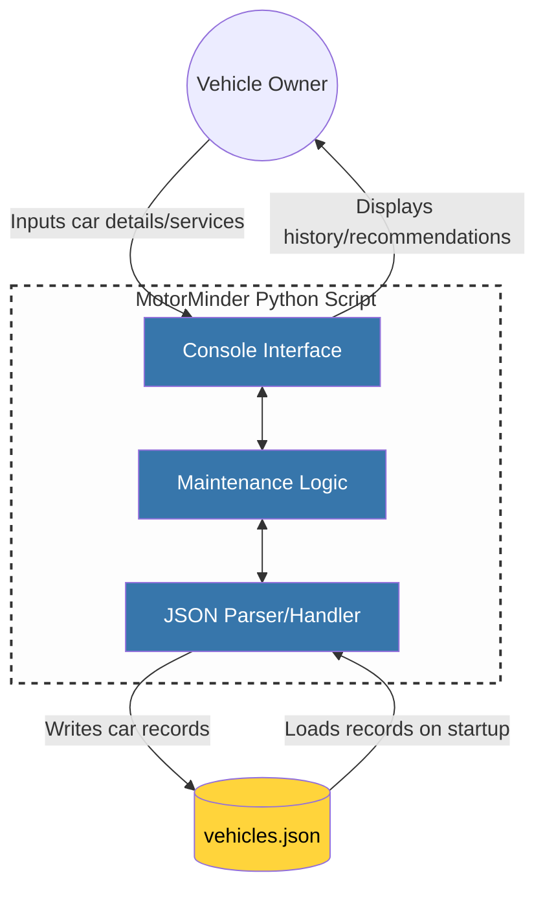

# MotorMinder

## Overview

<!--
Brief description of the project, its purpose, and the problem it solves.
-->

This project proposes the development of a car maintenance tracking and
recommendation application designed to help vehicle owners better understand,
manage, and maintain their vehicles' health. A lot of drivers have a hard time
keeping track of routine maintenance, like oil changes, tire rotations,
inspections, etc. This can lead to unnecessary repairs, wasted money, and
reduced vehicle lifespan. This application aims to consolidate vehicle
information to give the user valuable maintenance recommendations based on
vehicle condition data.

## Project Goals

<!--
High-level objectives for the system.
Example: improve vehicle maintenance awareness, reduce missed service intervals.
-->

On top of maintenance recommendations, the application will also include
functionality to track regular checkups and services. Users will be able to
record when a maintenance task was performed, update mileage, and view upcoming
or even overdue services. A third, and important, feature of the system is the
ability to find nearby mechanics. The application will provide a list of local
mechanic options (using sample data in the initial release), to allow users to
connect service visits with specific repair shops or providers.
A third feature of the system is the ability to find nearby mechanics. 
The application now includes a sample mechanic directory, allowing users to 
browse local repair shops, view ratings, available services, and contact 
information. This feature helps users associate service records with actual providers.
## Features

### Implemented in Sprint 1 (MVP)

<!--
List core features available in the first iteration.
-->

The focal point of our minimum viable product (MVP) will be tracking basic
vehicle information and simulating maintenance needs using sample data. Users
will be able to view one or more vehicles that will have associated attributes
like current mileage, service history, and overall health indicators. With this
information, the application will recommend when maintenance is due at
appropriate times, like oil changes, brake inspections and replacement, or tire
replacements. In the initial release, the application will not connect to real
vehicles, and all data will be generated and managed internally using predefined
or simulated vehicle records. Using this approach will allow the core logic and
system design to be developed without having to rely on any external hardware or
third-party integrations.

### Implemented in Sprint 2
In addition to vehicle tracking, the MVP now includes a mechanic lookup feature. 
Users can access a list of sample local mechanic shops, each with detailed 
information such as name, address, services offered, business hours, and ratings. 
This data is stored in a new mechanics.json file and can be viewed through the CLI.
## System Architecture

<!--
High-level description of system components.
Reference the architecture diagram.
-->

MotorMinder is organized into several core components:

- **CLI (Console Interface):** The main entry point for user interaction.
  Presents menus, receives user input, and displays information and
  recommendations. The CLI includes a “Find Mechanics” option that
  pulls data from mechanics.json and displays nearby service centers.
- **Controller:** Acts as the bridge between the CLI and the underlying
  data/model logic. Processes user actions, updates data, and coordinates
  responses.
- **DataHandler:** Manages all data persistence and retrieval. Loads and saves
  vehicle and service data to JSON files, ensuring data consistency and
  integrity. Implemented as a Singleton to centralize data access.
- **Models:** Define the core data structures, such as Vehicle, ServiceRecord,
  and enumerations for service types.
- **View:** Handles formatting and presentation of output in the CLI, including
  colors and text styles for better readability.
- **Storage (vehicles.json, service_intervals.json):** JSON files used to store
  user vehicle data and define maintenance intervals for different services.

These components interact to provide a modular, maintainable, and extensible
architecture for tracking vehicle maintenance and generating service
recommendations.

## Design Overview

### Object-Oriented Design

<!--
Brief explanation of how the system is structured using OO principles.
-->

MotorMinder is architected using object-oriented (OO) design principles to
ensure clarity, scalability, and maintainability. The system is decomposed into
discrete classes, each representing a specific business entity or
responsibility:

- **Encapsulation:** All data and behaviors related to vehicles, services, and
  user interactions are encapsulated within their respective classes (e.g.,
  `Vehicle`, `ServiceRecord`, `DataHandler`, `CLI`). This ensures that internal
  state is protected and only accessible through well-defined interfaces.

- **Abstraction:** The system exposes only essential operations to the user and
  other components, hiding implementation details. For example, the
  `DataHandler` abstracts file I/O and data persistence, while the `Controller`
  abstracts business logic and workflow coordination.

- **Inheritance and Polymorphism:** Where appropriate, shared behaviors and
  attributes are defined in base classes or through composition. This allows for
  code reuse and flexibility in extending system functionality. For example, if
  new types of vehicles or services are introduced, they can inherit from
  existing base classes.

- **Separation of Concerns:** The application is divided into layers (Model,
  View, Controller), each with a distinct responsibility. The Model layer
  manages data and business rules, the View layer handles user interface and
  presentation, and the Controller layer processes user input and orchestrates
  application flow.

This OO structure enables MotorMinder to be easily extended with new features,
simplifies testing and debugging, and supports robust, long-term maintenance.
The design aligns with industry best practices for enterprise-grade software
systems, ensuring that the application remains reliable and adaptable as
requirements evolve.

### Design Patterns

<!--
List and justify selected design patterns (e.g., Strategy, Factory, Observer).
-->

#### 1. Model-View-Controller (MVC)

**Pattern:** MVC

- **Model:** Handles data logic and persistence (`models.py`,
  `data_handler.py`).
- **View:** Manages CLI formatting and user output (`view.py`).
- **Controller:** Bridges user actions and model updates (`controller.py`).
- **CLI:** Entry point for user interaction (`cli.py`).

**Benefit:** Promotes separation of concerns, easier maintenance, and
scalability.

---

#### 2. Singleton Pattern

**Pattern:** Singleton

- **Where:** `DataHandler` class in `data_handler.py`.
- **How:** Uses a class-level `_instance` and custom `__new__` method to ensure
  only one instance exists for data management.

**Benefit:** Centralizes data access and persistence, prevents conflicting data
states.

---

#### 3. Command Pattern

**Pattern:** Command

- **Where:** `CLI` class in `cli.py`.
- **How:** Maps user menu selections to method calls, acting as a command
  dispatcher.

**Benefit:** Simplifies user input handling, makes adding new commands
straightforward.

---

## UML Diagrams

<!--
List included UML diagrams (Class, Use Case, etc.).
-->

### Class Diagram


### Architecture Diagram



### Use Case Diagram


## Data Model

<!--
Explain the use of sample/mock vehicle data and why it is used in Sprint 1.
-->

In Sprint 1, MotorMinder uses sample vehicle data to test and demonstrate core
features without relying on real-world data. This allows rapid development and
ensures maintenance tracking and recommendations work as intended before
integrating actual vehicle data in future releases.

In Sprint 2, MotorMinder uses sample mechanic data to test and demonstrate core
features without relying on real-world data. This will ensure that a user
will be able to find mechanic for their vehicle before we start adding in real 
raw data. 

## Testing

### Testing Plan

<!--
High-level testing strategy.
-->

Testing in Sprint 1 focuses on validating the core functionality of the MVP,
including data handling, vehicle and service logic, and basic user interaction
through the terminal-based prototype. Because the system uses simulated vehicle
data, testing is limited to logical correctness rather than real-world accuracy.

#### Testing Objectives

- Verify that sample vehicle data is loaded and stored correctly
- Ensure maintenance service recommendations are generated based on mileage
  rules
- Validate correct interaction flow in the terminal interface
- Identify and document defects early in development
-  Verify that sample mechanic data is loaded and stored correctly

#### Types of Testing

##### Unit Testing

Unit testing will focus on individual classes and methods, including:

- Vehicle mileage updates
- Service due calculations
- JSON data creation and loading

Unit tests will be manual or lightweight, as automated testing is planned for
future sprints.

##### Integration Testing

Integration testing will verify interactions between major components,
including:

- DataHandler loading vehicle data into the system
- Controller accessing vehicle and service information
- Correct data flow between classes

##### System Testing

System testing will be performed by running the prototype end-to-end to ensure:

- Users can view vehicle information
- Maintenance recommendations are displayed correctly
- The application behaves as expected under normal usage
- Users can view mechanic information

#### Test Environment

- **Programming Language:** Python
- **Execution Environment:** Local development machines
- **Data Source:** Simulated JSON vehicle data
- **Interface:** Terminal-based user interface

#### Defect Tracking

Defects identified during testing will be documented using a standardized bug
report template. Each report will include a description of the issue, steps to
reproduce, expected behavior, and actual behavior. Bug resolution will be
prioritized in future sprints.

#### Roles and Responsibilities

All team members are responsible for testing features they implement. The team
lead coordinates testing efforts and ensures that defects are documented and
reviewed.

#### Limitations

Testing in Sprint 1 does not include performance, security, or real vehicle data
validation. These areas are planned for later sprints as system functionality
expands.

## Future Enhancements

<!--
Planned improvements such as real vehicle integration, expanded diagnostics, etc.
-->

Future Improvements • Export maintenance logs to CSV or PDF • Add reminder
notifications (e.g., via email or system alerts) • Implement user accounts •
Develop a GUI

## Team Roles and Responsibilities

<!--
List team members and their primary responsibilities.
-->

The team follows a collaborative development model in which all members
contribute to design, implementation, and documentation. Responsibilities are
distributed by area of focus rather than rigid job titles to support flexibility
and shared ownership of the project.

- **Preston Little - Team Lead / Systems Coordination**
  - Facilitates SCRUM meetings and sprint planning
  - Maintains contribution logs and meeting notes
  - Oversees system architecture and design consistency
  - Contributes to core design artifacts and implementation
- **Ethan Hess – Architect & MVP Developer**
  - Designed and implemented the core system architecture and all major
    application components (CLI, controller, data handling, models, and view)
  - Developed the initial MVP, including maintenance logic, CLI features, and
    data persistence
  - Authored and maintained the architecture and class diagrams
  - Led the integration of design patterns and refactoring for maintainability
  - Wrote and maintained unit tests and bug reports for the MVP
  - Contributed to documentation, design patterns, and overall project direction
- **Ethan Kidd – Requirements & Diagrams**
  - Helped develop and refine UML and use case diagrams for the project
  - Assisted with requirements gathering, analysis, and documentation
  - Participated in design and code reviews
  - Contributed to project documentation and supported team discussions
- **Ryan Carbine – Testing & Diagrams**
  - Assisted in developing and updating test files and scripts
  - Contributed to UML and use case diagrams
  - Helped with requirements analysis and documentation
  - Participated in design reviews and provided feedback on implementation

## Setup and Usage

<!--
Instructions for running the prototype.
-->

### Installation

**Requirements:**  
`Python 3.10+`

### Setup

After downloading the program you’ll see the menu:

```cmd
MotorMinder - Maintenance Tracker

1. List Vehicles
2. Add Vehicle
3. Edit Vehicle
4. Log Service
5. Maintenance Dashboard
6. Find Mechanics
7. Exit
```

### Usage

1. **Add a Vehicle**  
   Make: Toyota  
   Model: Camry  
   Year: 2020  
   Current Mileage: 25000  
   Vehicle added.
2. **Edit a Vehicle**  
   Update make, model, year, or mileage or delete the vehicle entirely.
3. **Log a Service**  
   Record a service event:  
   Select vehicle index: 0  
   Select service: Oil Change  
   Service mileage: 26000  
   Service date (YYYY-MM-DD, blank for today):  
   Service logged.
4. **Maintenance Dashboard**  
   Displays each vehicle’s maintenance status:  
   [0] 2020 Toyota Camry  
   Odometer: 26000  
   ✅ Oil Change: OK (Due @ 32000 mi)  
   🟡 Tire Rotation: Due Soon (Due @30000mi)  
   🔴 Battery: Overdue (1,200 mi over)
5. **Mechanic Overview**
   [0] Gearhead Garage
   Services: Oil Change, Tire Rotation, Brake Fluid, Battery
   Rating: 4.3 | Price: $$
   Address: 123 Main Street, Orem, UT 84058
   Hours: Mon–Fri 8:00–17:00 | Sat 9:00–14:00 | Sun Closed

### Data Storage

All data is stored locally in a JSON file (vehicles.json), automatically created
at first run. Example:

```json
{
  "vehicles": [
    {
      "make": "Honda",
      "model": "Civic",
      "year": 2019,
      "current_mileage": 42000,
      "last_service": {
        "oil_change": { "mileage": 40000, "date": "2025-10-01" },
        "tire_rotation": { "mileage": 38000, "date": "2025-08-15" }
      }
    }
  ]
}
```

Customization service_intervals.json Defines when each service becomes Due Soon
or Overdue by mileage or time:

```json
{
  "OIL_CHANGE": { "miles": [4000, 6000], "months": [4, 6] },
  "TIRE_ROTATION": { "miles": [5000, 8000] },
  "BATTERY": { "years": [3, 5] }
}
```

Key Meaning "miles": [min, max] Min = Due Soon threshold; Max = Overdue
threshold "months" / "years" Optional time-based thresholds

Example Session

1. Add Vehicle
2. Log Oil Change
3. View Dashboard Output: [0] 2020 Toyota Camry Odometer: 26000 ✅ Oil Change:
   OK (Due @ 32000 mi) 🟡 Tire Rotation: Due Soon

## Repository Structure

<!--
Brief explanation of important directories/files.
-->

### MotorMinder Repository Structure

```text
src/
├── main.py                # Entry point, runs CLI
├── cli.py                 # Handles user interaction and menu navigation
├── controller.py          # Core application logic and service status checks
├── data_handler.py        # Handles JSON data loading, saving, and updating
├── models.py              # Defines Vehicle, ServiceRecord, and ServiceName enums
├── view.py                # Handles CLI formatting (colors, bold text, etc.)
├── service_intervals.json # Defines maintenance intervals for each service
├── vehicles.json          # Auto-generated data file for user’s vehicles
|-- mechanics.json         # New JSON file for local mechanic directory
```

## Contributers

Ethan Hess, Ethan Kidd, Preston Little, Ryan Carbine
