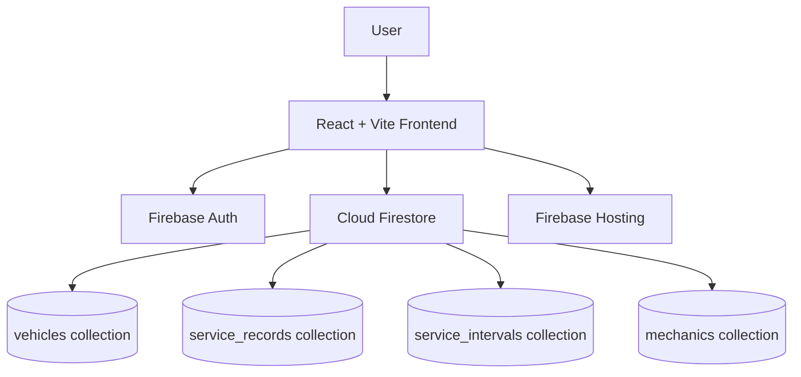
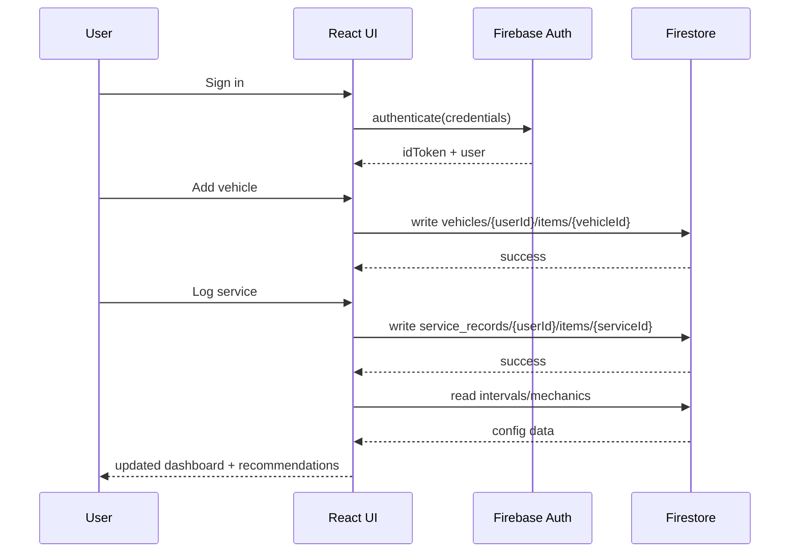

# MotorMinder Migration Plan: Python CLI -> React + Vite + Firebase

## Purpose

This document is the team guide for migrating MotorMinder from a Python CLI app to a web-only stack using:

- React
- Vite
- Firebase Hosting
- Firebase Authentication
- Cloud Firestore

This plan focuses on:

1. Configuring the development environment
2. Documenting teammate workflows for React + Vite + Firebase
3. Defining the Python migration plan, including UML and OOP/layer documentation

For a concrete, repo-specific implementation checklist (including starter file templates), see `docs/vite_react_setup.md`.

## Scope and Assumptions

### In Scope

- Web-only migration strategy
- Team onboarding and setup documentation
- Architecture mapping from current Python MVC to web architecture
- UML artifacts in Mermaid
- OOP principles/layer documentation for the new stack

### Out of Scope (for now)

- Mobile clients
- Advanced production SRE runbooks
- Full CI/CD automation implementation

### Baseline References

- README.md
- docs/codebase_structure.md
- docs/mvp.md
- docs/diagrams/Architecture.md
- mvp/cli.py
- mvp/controller.py
- mvp/data_handler.py
- mvp/models.py

---

## 1) Development Environment Configuration

### 1.1 Prerequisites

- Node.js LTS (v20+ recommended)
- npm (comes with Node)
- Git
- Firebase CLI
- A Firebase project (dev)

### 1.1.1 Recommended: Dev Container Workflow

This repository includes a dev container configuration in `.devcontainer/`.

Use this when you want a consistent toolchain across teammates (Node, Python, Java, Firebase CLI).

Steps:

1. Install Docker Desktop
2. Install VS Code extension: Dev Containers
3. Open this repository in VS Code
4. Run command: `Dev Containers: Reopen in Container`
5. Wait for post-create setup to finish (`.devcontainer/post-create.sh`)
6. Run `firebase login` inside the container terminal

After that, continue with app setup and local commands from this document.

Install Firebase CLI:

```bash
npm install -g firebase-tools
```

Login:

```bash
firebase login
```

### 1.2 Create React + Vite App

```bash
npm create vite@latest web -- --template react
cd web
npm install
```

Using `web/` keeps frontend migration isolated from the Python MVP in `mvp/`.

### 1.3 Add Firebase SDK

```bash
npm install firebase
```

### 1.4 Initialize Firebase in Project

From the web app root:

```bash
firebase init
```

Select:

- Hosting
- Firestore
- Functions
- Emulators (Auth + Firestore + Hosting + Functions)

### 1.5 Environment Variables

Create `.env.local` with frontend Firebase config values:

```bash
VITE_FIREBASE_API_KEY=
VITE_FIREBASE_AUTH_DOMAIN=
VITE_FIREBASE_PROJECT_ID=
VITE_FIREBASE_STORAGE_BUCKET=
VITE_FIREBASE_MESSAGING_SENDER_ID=
VITE_FIREBASE_APP_ID=
```

### 1.6 Local Development Commands

```bash
npm run dev
firebase emulators:start
```

### 1.7 Build and Deploy

```bash
npm run build
firebase deploy --only hosting
```

---

## 2) Teammate Onboarding Guide (Balanced)

### 2.1 First-Day Checklist

1. Clone repository
2. Install Node dependencies
3. Create `.env.local`
4. Run Vite app
5. Run Firebase emulators
6. Validate Auth and Firestore connection in local UI

### 2.2 Day-to-Day Workflow

1. Pull latest changes from main
2. Create feature branch
3. Run app + emulators
4. Implement feature with layer boundaries (UI -> service -> Firebase)
5. Run tests/lint
6. Open PR with screenshots and migration notes

### 2.3 Common Pitfalls

- Missing `.env.local` values -> Firebase initialization errors
- Wrong Firebase project selected -> data written to wrong environment
- Emulator not running -> auth/database requests fail locally
- Firestore rules mismatch -> permission denied errors

### 2.4 Recommended Team Conventions

- Use JavaScript-first approach for MVP speed (TypeScript can be introduced later)
- Keep Firebase logic in service modules, not React components
- Keep shared domain types centralized
- Document any schema/rule updates in this file

---

## 3) Migration Architecture Plan

### 3.1 Current Python Architecture (Source)

- CLI: user interaction and command loop (`mvp/cli.py`)
- Controller: business flow and service logic (`mvp/controller.py`)
- DataHandler: JSON persistence (`mvp/data_handler.py`)
- Models: domain entities (`mvp/models.py`)

### 3.2 Target Web Architecture

- Frontend Layer: React pages/components + routing
- Application Layer: service functions/custom hooks for domain workflows
- Data Layer: Firestore adapters/repositories
- Platform Layer: Firebase Auth, Firestore, Hosting

### 3.3 Layer Mapping (Python -> Web)

| Current Python Component | Responsibility         | Web Equivalent                  |
| ------------------------ | ---------------------- | ------------------------------- |
| CLI                      | Menu interactions      | React routes/pages and UI flows |
| Controller               | Business orchestration | App services/use cases          |
| DataHandler (Singleton)  | JSON file I/O          | Firestore repository layer      |
| Models                   | Domain structures      | JavaScript data shapes/modules  |

### 3.4 Data Ownership Model

- User-owned data (vehicles/service records) scoped by authenticated user ID
- Shared/seed data (service intervals, mechanics) stored as read-only collections initially

### 3.5 Hosting and Runtime Model (Firebase-First)

For this migration, host each concern in managed Firebase/GCP services:

| Concern                   | Platform                               | What runs there                                |
| ------------------------- | -------------------------------------- | ---------------------------------------------- |
| Web UI                    | Firebase Hosting                       | React + Vite build output (`web/dist`)         |
| Authentication            | Firebase Auth                          | User identity, sessions, ID tokens             |
| Primary data              | Cloud Firestore                        | Vehicles, service logs, mechanics, intervals   |
| Trusted backend logic     | Cloud Functions for Firebase (2nd gen) | Validation, privileged writes, scheduled tasks |
| Local integration testing | Firebase Emulator Suite                | Auth + Firestore + Hosting + Functions         |

Notes:

- Firebase Hosting serves static assets; it does not run Python/FastAPI directly.
- If server-side logic is required, use Cloud Functions for MVP. Cloud Run is a later option for specialized workloads.

### 3.6 Recommended Firebase Services by Phase

#### MVP Baseline (required)

- Firebase Hosting
- Firebase Authentication
- Cloud Firestore
- Firestore Security Rules
- Emulator Suite

#### MVP Hardening (recommended before production)

- Cloud Functions for Firebase (2nd gen)
- Firestore indexes and stricter rules validation

#### Post-MVP (optional)

- Cloud Messaging (maintenance reminders)
- Analytics / Crash reporting
- App Check

### 3.7 Firestore Collection Design (MVP)

Use a user-scoped model for private records and top-level read-only config collections:

```text
users/{uid}
  vehicles/{vehicleId}
    make, model, year, currentMileage, createdAt, updatedAt
  service_logs/{logId}
    vehicleId, serviceName, mileage, date, notes, createdAt

service_intervals/{serviceName}
  miles: [dueSoon, overdue]
  months: [dueSoon, overdue] (optional)
  years: [dueSoon, overdue] (optional)

mechanics/{mechanicId}
  name, address, phone, services, rating, hours
```

Design rationale:

- Private user data stays under `users/{uid}/...` for straightforward rule scoping.
- Shared config/reference data (`service_intervals`, `mechanics`) remains top-level and read-only for normal clients.

### 3.8 Security and Rules Boundaries

Rules intent for MVP:

- Authenticated users can read/write only their own documents under `users/{uid}/...` where `request.auth.uid == uid`.
- Clients can read `service_intervals` and `mechanics`.
- Clients cannot modify `service_intervals` or `mechanics` directly.
- Admin/privileged operations happen via Cloud Functions using Admin SDK.

Boundary guideline:

- Non-sensitive orchestration can remain in frontend services during early MVP.
- Shared, sensitive, or abuse-prone logic (write validation, normalization, reminder scheduling) should move to Cloud Functions before production cutover.

### 3.9 End-to-End Request Flows (Hosted)

#### Flow A: Sign-in + List Vehicles

1. React app loads from Firebase Hosting.
2. User signs in with Firebase Auth.
3. React reads Firestore path `users/{uid}/vehicles`.
4. UI renders vehicle list.

#### Flow B: Log Service (direct client write)

1. User submits service event from React page.
2. React writes to `users/{uid}/service_logs`.
3. React updates `users/{uid}/vehicles/{vehicleId}` (e.g., mileage).
4. Dashboard recomputes status in frontend service layer.

#### Flow C: Log Service (hardened write path)

1. React calls Cloud Function with payload.
2. Function validates auth, schema, and business rules.
3. Function writes service log + vehicle update atomically.
4. React reads updated data and refreshes dashboard.

### 3.10 Migration Mapping from Current MVP

| Current Python MVP                        | Firebase + React Target                                        |
| ----------------------------------------- | -------------------------------------------------------------- |
| `mvp/cli.py` menu loop                    | React routes/pages + UI components                             |
| `mvp/controller.py` orchestration         | Frontend service layer, then Cloud Functions for trusted paths |
| `mvp/data_handler.py` JSON persistence    | Firestore repositories + rules                                 |
| `mvp/models.py` dataclasses/enums         | JavaScript data shapes/constants                               |
| `mvp/vehicles.json` local file            | Firestore user-scoped collections                              |
| `mvp/service_intervals.json` local config | Firestore read-only config collection                          |

---

## 4) UML Diagrams (Mermaid)

### 4.1 Target Component Diagram



### 4.2 Sequence Diagram: Login + Vehicle + Service Log



---

## 5) OOP Design Principles Across Layers

### 5.1 Encapsulation

- Keep Firebase reads/writes inside repository/service modules
- UI components consume typed service functions only

### 5.2 Separation of Concerns

- Presentation: React components/pages
- Domain logic: service/use-case layer (maintenance calculations, workflow logic)
- Persistence: Firestore repositories

### 5.3 Composition Over Inheritance

- Compose features via hooks and services
- Keep shared behavior in utilities instead of deep class hierarchies

### 5.4 Interface Boundaries

- Define explicit interfaces/types for Vehicle, ServiceRecord, Mechanic
- Keep DTO validation between UI and persistence boundaries

### 5.5 Pattern Translation (Old -> New)

- MVC remains conceptually useful:
  - View -> React UI
  - Controller -> app services/use cases
  - Model -> JavaScript domain modules and constants
- Singleton DataHandler becomes Firebase SDK singleton init + repository modules
- Command menu actions become route-based UI actions and event handlers

---

## 6) Python Migration Execution Plan (Phased)

### Phase 0: Freeze and Baseline

- Freeze current Python behavior and JSON structure
- Capture baseline outputs/tests for regression reference

### Phase 1: Domain Model Port

- Port `Vehicle`, `ServiceRecord`, `Mechanic`, and service name enums to JavaScript modules/constants
- Ensure field parity with existing JSON schemas

### Phase 2: Data Layer Migration

- Replace JSON persistence with Firestore repository interfaces
- Add adapters for vehicle CRUD and service logs
- Seed service intervals and mechanics collections

### Phase 3: Business Logic Migration

- Migrate maintenance status logic from controller to service layer
- Keep output-compatible rule behavior for due/due soon/overdue statuses

### Phase 4: UI Flow Migration

- Build pages for:
  - Vehicle list/add/edit/delete
  - Log service
  - Maintenance dashboard
  - Mechanic lookup
- Wire UI to Auth + Firestore services

### Phase 5: Testing Migration

- Keep Python tests as temporary reference
- Add web unit tests for domain logic
- Add integration tests using Firebase emulators

### Phase 6: Cutover and Rollback

- Define cutover checklist (feature parity + smoke tests)
- Keep rollback path to last stable Python CLI release

---

## 7) Verification Checklist

- Commands in this document run successfully on a clean setup
- Firebase emulators start and support local flows
- Mermaid diagrams render correctly in VS Code preview
- Layer mappings are traceable to existing Python files
- At least one teammate completes onboarding from this doc alone

---

## 8) Next-Step Decisions to Confirm

1. JavaScript is the default (recommended for current MVP)
2. Mechanics data strategy: static seed vs editable collection
3. Business logic placement: frontend service layer only vs backend API/Cloud Functions

For now, this document is the source-of-truth migration plan and teammate onboarding guide for the web transition.
