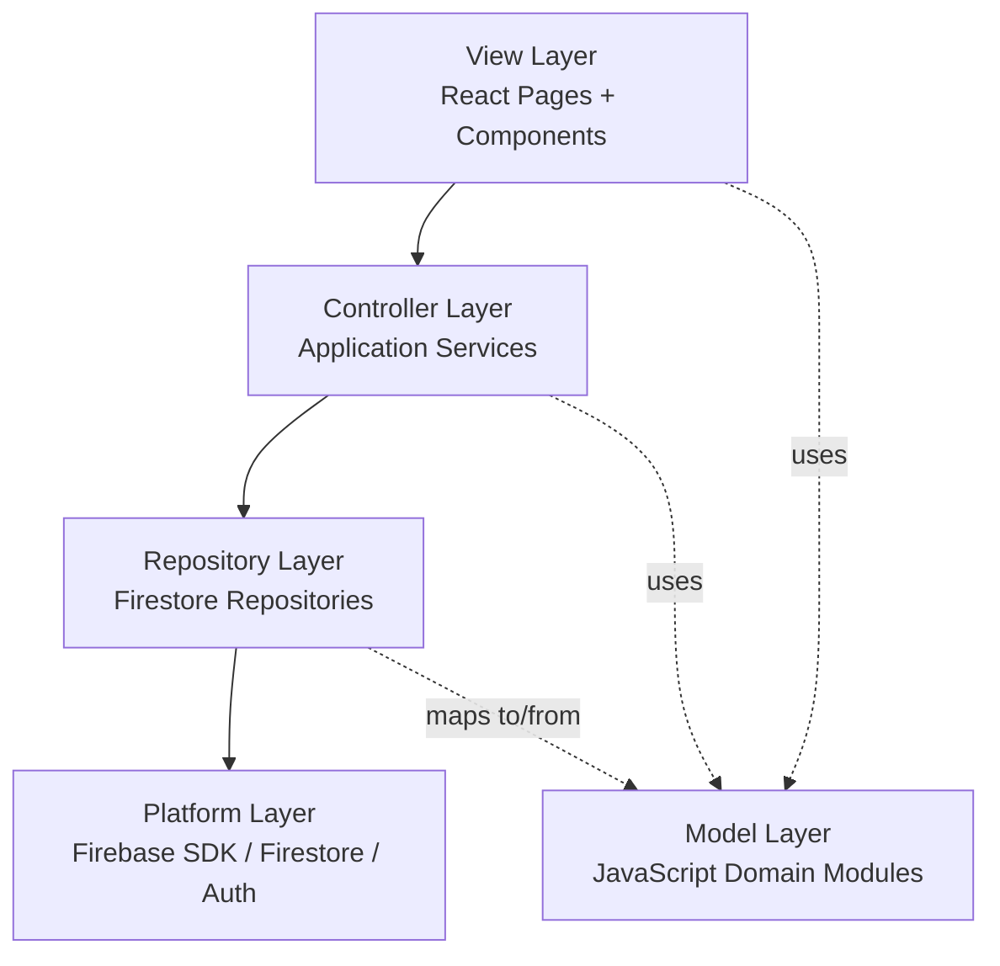
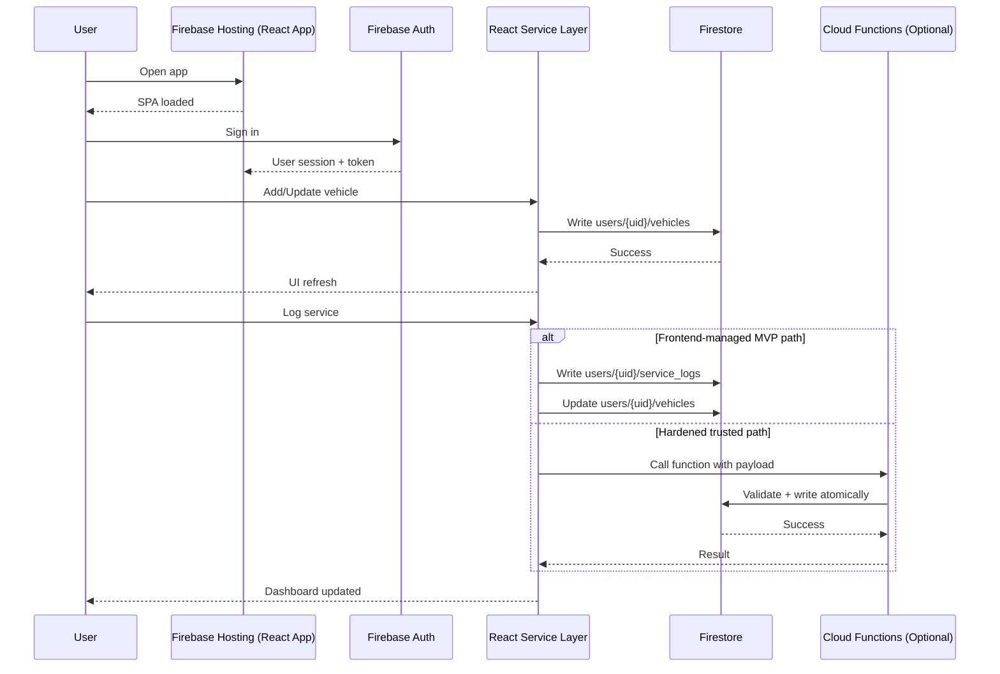
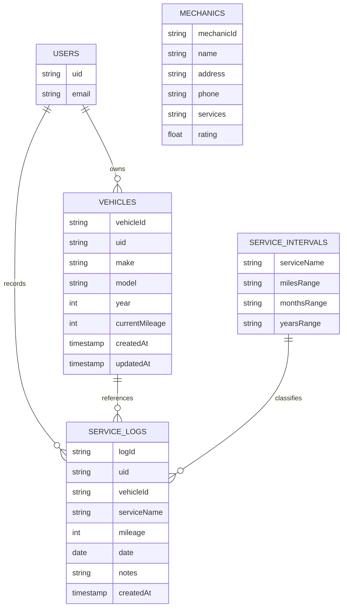

# MotorMinder Software Architecture (React + Firebase)

## Architecture Quick Start

Use this section for a fast onboarding pass before reading the full document.

### Start Here (5-minute overview)

1. Read [Layer Dependency Diagram](#111-layer-dependency-diagram)
2. Read [Deployment Topology Diagram](#115-deployment-topology-diagram)
3. Read [Runtime Request Flow Diagram (MVP)](#112-runtime-request-flow-diagram-mvp)
4. Read [Firestore Data Model Diagram](#113-firestore-data-model-diagram)
5. Read [Security Boundary Diagram](#114-security-boundary-diagram)

### First-Day Implementation Checklist

- Keep dependency direction: View -> Services -> Repositories -> Firebase SDK
- Put business logic in services, not React components
- Keep Firestore access inside repository modules
- Keep user data under `users/{uid}/...` paths
- Treat shared collections (`service_intervals`, `mechanics`) as read-only from clients

### Debugging Shortcut Map

- Wrong UI behavior with correct data: check service-layer logic and [Layer Dependency Diagram](#111-layer-dependency-diagram)
- Data not loading/saving: check repository paths and [Runtime Request Flow Diagram (MVP)](#112-runtime-request-flow-diagram-mvp)
- Permission denied errors: check rules assumptions and [Security Boundary Diagram](#114-security-boundary-diagram)
- Environment mismatch (local vs deployed): check [Deployment Topology Diagram](#115-deployment-topology-diagram)

---

## 1) Architectural Approach

For this project, **MVC is the right primary pattern** for the MVP migration.

- It maps directly from the current Python architecture (`CLI`/`Controller`/`Model`).
- It keeps business logic out of UI components.
- It supports a clean migration path from frontend-first logic to trusted backend logic when needed.

In the web stack, MVC is implemented as:

- **View** -> React pages/components
- **Controller** -> React service layer (and optional Cloud Functions for trusted operations)
- **Model** -> JavaScript domain modules/constants + Firestore documents

---

## 2) Layers and Responsibilities

## 2.1 Presentation Layer (View)

**Tech:** React + Vite + React Router

Responsibilities:

- Render pages and reusable UI components
- Collect user input
- Trigger application service calls
- Display loading/error/success states

Rules:

- No direct Firestore SDK calls in page components
- No heavy maintenance-status logic in JSX

---

## 2.2 Application Layer (Controller)

**Tech:** JavaScript service modules (frontend), optional Firebase Functions (server)

Responsibilities:

- Orchestrate feature workflows (add vehicle, log service, dashboard view)
- Execute maintenance calculations and sorting
- Validate and normalize user-facing input
- Coordinate repository reads/writes

Modules (suggested):

- `maintenanceService` (status rules)
- `vehicleService` (vehicle workflows)
- `serviceLogService` (service log workflows)

This layer is the conceptual successor to `mvp/controller.py`.

---

## 2.3 Domain Layer (Model)

**Tech:** JavaScript modules/constants + pure domain functions

Responsibilities:

- Define domain entities (`Vehicle`, `ServiceRecord`, `ServiceName`, `Mechanic`)
- Define value constraints and shared domain semantics
- Provide framework-agnostic domain utilities where useful

This layer is the conceptual successor to `mvp/models.py`.

---

## 2.4 Data Access Layer (Repository)

**Tech:** Firestore repository modules

Responsibilities:

- Encapsulate all Firestore reads/writes
- Map Firestore documents <-> domain types
- Provide query and persistence APIs to application services

Suggested repositories:

- `vehicleRepository`
- `serviceLogRepository`
- `intervalRepository`
- `mechanicRepository`

This layer replaces JSON file persistence from `mvp/data_handler.py`.

---

## 2.5 Platform Layer

**Tech:** Firebase Hosting, Firebase Auth, Firestore, Emulator Suite

Responsibilities:

- Hosting serves SPA assets
- Auth issues identity and session tokens
- Firestore stores operational data
- Emulators support local development and integration tests

Optional for hardening:

- Cloud Functions for trusted/privileged logic

---

## 3) Layer Interaction Rules

To keep architecture maintainable, enforce this dependency direction:

`View -> Application Services -> Repositories -> Firebase SDK`

And for types/utilities:

`All layers -> Domain types`

Allowed:

- React component calling `vehicleService.addVehicle(...)`
- Service calling `vehicleRepository.create(...)`
- Repository calling Firestore SDK

Not allowed:

- React component directly writing to Firestore
- Repository containing JSX/UI formatting
- Domain types importing React/Firebase APIs

---

## 4) Request/Feature Interaction Flows

## 4.1 Add Vehicle

1. User submits form in Vehicles page.
2. Page calls `vehicleService.addVehicle(input)`.
3. Service validates and normalizes input.
4. Service calls `vehicleRepository.create(uid, vehicle)`.
5. Repository writes to `users/{uid}/vehicles/{vehicleId}`.
6. Page refreshes list state.

## 4.2 Log Service

1. User submits service log form.
2. Page calls `serviceLogService.logService(input)`.
3. Service validates input and coordinates multi-write logic.
4. Repository writes log + updates vehicle mileage.
5. Dashboard data is refreshed.

## 4.3 Maintenance Dashboard

1. Page requests vehicles and latest service records.
2. `maintenanceService` computes `OK`, `Due Soon`, `Overdue` statuses.
3. View renders grouped/sorted status cards.

---

## 5) OOP Principles Applied

## 5.1 Encapsulation

- Firestore logic is encapsulated inside repositories.
- UI behavior is encapsulated in components.
- Maintenance business logic is encapsulated in domain/application services.

## 5.2 Abstraction

- Components use service interfaces, not persistence details.
- Services use repository interfaces, not low-level SDK calls.

## 5.3 Separation of Concerns

- View renders and handles interaction.
- Application services orchestrate workflows.
- Repositories persist and fetch data.
- Domain layer models business concepts.

## 5.4 Composition Over Inheritance

- Compose behavior through small services/hooks/utilities.
- Avoid deep class hierarchies in frontend code.

## 5.5 Polymorphism Through Interfaces

- Repository interfaces enable swapping implementations (e.g., emulator/mock vs production Firestore).
- Service contracts support testing and future backend migration.

---

## 6) Why MVC Is the Best Fit Here

MVC is preferred for this project because:

- It preserves conceptual continuity with the current Python MVP.
- It creates clean boundaries during migration.
- It minimizes coupling between React UI and Firebase details.
- It keeps the option open to move selected controller logic to Cloud Functions later.

Alternative patterns like full Clean Architecture are possible, but MVC + layered services is a better complexity match for current MVP scope.

---

## 7) Hosting and Deployment Mapping

- **Firebase Hosting:** React SPA artifacts (`web/dist`)
- **Firebase Auth:** user identity and session
- **Cloud Firestore:** application data
- **Firebase Emulator Suite:** local development and integration verification
- **Cloud Functions (optional now, recommended later):** trusted operations and scheduled jobs

---

## 8) Suggested Project Structure (Web)

```text
web/src/
  app/
  pages/             # View layer
  components/        # View layer
  services/          # Application layer (Controller)
  repositories/      # Data access layer
  types/             # Domain model layer
  lib/firebase.js    # Platform initialization
```

---

## 9) Migration Mapping from Current Python Code

- `mvp/cli.py` -> React pages/components
- `mvp/controller.py` -> `web/src/services/*`
- `mvp/data_handler.py` -> `web/src/repositories/*`
- `mvp/models.py` -> `web/src/types/domain.js`
- `mvp/service_intervals.json` -> Firestore `service_intervals` collection
- `mvp/vehicles.json` -> Firestore `users/{uid}/vehicles` + `users/{uid}/service_logs`

---

## 10) Architecture Decision Summary

**Decision:** Use **MVC with layered service/repository boundaries** for MVP migration.

**Resulting benefits:**

- Fast implementation with clean structure
- High testability of business logic
- Easy onboarding and maintainability
- Safe path to incrementally introduce backend-trusted logic when needed

---

## 11) Companion Diagrams (Mermaid)

## 11.1 Layer Dependency Diagram



## 11.2 Runtime Request Flow Diagram (MVP)



## 11.3 Firestore Data Model Diagram



## 11.4 Security Boundary Diagram

```mermaid
graph LR
  U[Authenticated User]
  UI[React App]
  RUL[Firestore Security Rules]
  PRIV[Cloud Functions\nAdmin SDK]

  subgraph UserScoped[User-Scoped Data]
    VCOL[(users/{uid}/vehicles)]
    LCOL[(users/{uid}/service_logs)]
  end

  subgraph SharedReadOnly[Shared Reference Data]
    ICOL[(service_intervals)]
    MCOL[(mechanics)]
  end

  U --> UI
  UI --> RUL
  RUL --> VCOL
  RUL --> LCOL
  RUL --> ICOL
  RUL --> MCOL

  UI --> PRIV
  PRIV --> VCOL
  PRIV --> LCOL
  PRIV --> ICOL
  PRIV --> MCOL
```

## 11.5 Deployment Topology Diagram

```mermaid
graph TD
  Dev[Developer] --> Repo[Git Repository]
  Repo --> Build[Vite Build]
  Build --> Host[Firebase Hosting]

  User[End User Browser] --> Host
  Host --> App[React SPA]

  App --> Auth[Firebase Auth]
  App --> DB[Cloud Firestore]
  App --> Fn[Cloud Functions (optional trusted path)]
  Fn --> DB

  Dev --> Emu[Firebase Emulator Suite]
  Emu --> EmuAuth[Auth Emulator]
  Emu --> EmuDB[Firestore Emulator]
  Emu --> EmuFn[Functions Emulator]
  Emu --> EmuHost[Hosting Emulator]
```

## 11.6 Python-to-Web Migration Mapping Diagram

```mermaid
flowchart LR
  subgraph PY[Current Python MVP]
    CLI[mvp/cli.py]
    CTL[mvp/controller.py]
    DH[mvp/data_handler.py]
    MOD[mvp/models.py]
    VJ[mvp/vehicles.json]
    SI[mvp/service_intervals.json]
  end

  subgraph WEB[Target React + Firebase]
    PAGES[React Pages/Components]
    SRV[Service Layer]
    REPO[Repository Layer]
    TYPES[JavaScript Domain Modules]
    FV[(Firestore users/{uid}/vehicles)]
    FL[(Firestore users/{uid}/service_logs)]
    FI[(Firestore service_intervals)]
  end

  CLI --> PAGES
  CTL --> SRV
  DH --> REPO
  MOD --> TYPES
  VJ --> FV
  VJ --> FL
  SI --> FI
```

---

## 12) Diagram Reading Guide

Use this section to quickly choose the right diagram for each task.

| If you are trying to...                      | Start with                                   | Why                                                             |
| -------------------------------------------- | -------------------------------------------- | --------------------------------------------------------------- |
| Understand overall code boundaries           | 11.1 Layer Dependency Diagram                | Shows allowed dependency direction and layer responsibilities   |
| Trace user actions through runtime systems   | 11.2 Runtime Request Flow Diagram            | Shows Hosting/Auth/Service/Firestore/Functions request sequence |
| Implement collections and document fields    | 11.3 Firestore Data Model Diagram            | Defines entities and relationships for persistence              |
| Write or review Firestore security rules     | 11.4 Security Boundary Diagram               | Clarifies user-scoped vs shared data access boundaries          |
| Explain deployment architecture to teammates | 11.5 Deployment Topology Diagram             | Shows build, hosting, and emulator/production topology          |
| Plan migration work from Python modules      | 11.6 Python-to-Web Migration Mapping Diagram | Maps current files to target web layers                         |

Suggested reading order for new contributors:

1. 11.1 (layer boundaries)
2. 11.5 (where everything runs)
3. 11.2 (how requests flow)
4. 11.3 and 11.4 (data + security)
5. 11.6 (migration task planning)
